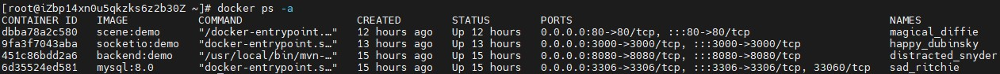

## 前端

前端使用的技术是vue3+three.js，使用three.js渲染3D场景，使用socket.io进行在线多人通信，使用axios向后端发送请求。

### 一、文件说明

在scene目录下，是使用vue3框架搭建的前端：

```shell
│  default.conf
│  Dockerfile
│  index.html
│  package-lock.json
│  package.json
│  vite.config.js
├─public
│  │  block.png
│  ├─animation
│  ├─image
│  ├─model
│  ├─text
│  └─texture
└─src
    │  App.vue
    │  main.js
    ├─api
    ├─assets
    ├─config
    ├─router
    ├─store
    └─views
```

其中Dockerfile用于构建Docker镜像，default.conf是镜像的nginx配置文件，public目录下存放3D场景相关的资源，src目录下是源代码。api目录下封装了axios对相关接口的请求，config目录下配置了项目环境，router目录下设置了路由规则，store目录配置了数据存储，views目录下是具体的页面视图。

在socketio目录下，是使用socket.io进行在线多人通讯的服务端：

```shell
    app.js
    Dockerfile
    index.html
    package-lock.json
    package.json
```

app.js是socket.io服务端的代码，Dockerfile用于构建Docker镜像。

### 二、代码实现细节

Scene.vue是3D场景的关键代码，封装了类Character，初始化过程中加载模型、纹理、动作，并且有坐标位置等属性。类LocalCharacter继承了类Character，在其基础上多出了人物控制的逻辑和相机视角的设置。通过socket.io，各个客户端不断向服务端发送人物位置等信息的更新，服务端将所有人物的位置信息广播给各个客户端，以此实现多人交互。

Login.vue和User.vue分别用于登录注册和用户信息展示，向后端发送请求并接收数据。

## 后端

后端使用的技术是springboot+mybatis，使用mvc三层架构，数据库使用的是mysql。使用maven作为jar包管理工具。

### 一、文件说明

1. main文件夹：主代码和配置代码

2. test文件夹：测试代码

3. controller文件夹：控制层代码，控制跳转

4. dao文件夹：dao层代码，用于数据库查询

5. exception文件夹：返回信息类和返回信息枚举类

6. pojo文件夹：用户实体类

7. service文件夹：service层代码，具体实现服务

8. util文件夹：返回类

9. Main类：springboot的主启动函数

10. Resource文件夹：存放配置信息

11. pom文件：maven导入的jar包信息和一些其他的maven配置

### 二、代码实现细节

springboot+mybatis和注解开发。使用json格式进行数据传输，使用restful风格进行资源定位。一共实现了三个接口，分别是登录，注册，获取用户id。这三个接口都有异常处理能力，当遇到异常情况，例如用户名为空，则会将对应的错误码和错误信息封装到返回类R中，并且发送给前端。

## 部署

项目被拆分成了三个服务：scene、socketio和backend，以容器化的形式部署到了公有云上，mysql数据库也被以容器化的形式单独部署。

scene服务的Dockerfile和defualt.conf：

```dockerfile
FROM nginx
COPY dist/  /usr/share/nginx/html/
COPY default.conf /etc/nginx/conf.d/default.conf
```

```shell
# nginx配置
server {
    listen       80;
    server_name  120.26.137.179;
 
    #charset koi8-r;
    access_log  /var/log/nginx/host.access.log  main;
    error_log  /var/log/nginx/error.log  error;
 
    location / {
        # root 根目录，默认nginx镜像的html文件夹，可以指定其他
        root   /usr/share/nginx/html;
        index  index.html index.htm;
        # 如果vue-router使用的是history模式，需要设置这个 
        try_files $uri $uri/ /index.html;
    }

    location /api/ {
        proxy_pass http://120.26.137.179:8080/;
    }
 
    #error_page  404              /404.html;
 
    # redirect server error pages to the static page /50x.html
    #
    error_page   500 502 503 504  /50x.html;
    location = /50x.html {
        root   /usr/share/nginx/html;
    }
}
```

socketio服务的Dockerfile：

```dockerfile
FROM node:20-slim
WORKDIR /usr/src/socketio
COPY . .
RUN npm install
CMD node app.js
```

backend服务的Dockerfile：

```dockerfile
FROM maven:3.8.1-openjdk-17
WORKDIR /usr/src/backend
COPY . .
COPY settings.xml /usr/share/maven/conf/settings.xml
RUN mvn install
RUN mvn package
CMD ["java", "-jar", "target/backend-1.0-SNAPSHOT.jar"]
```

docker容器运行和端口映射如下图所示：



访问服务器公网ip+80端口，可以正常进入系统，注册登录后可以进入多人3D场景，用户可以查看个人信息：


